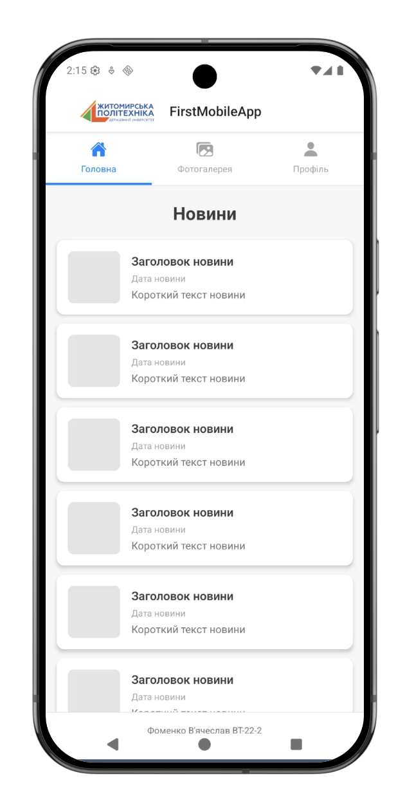
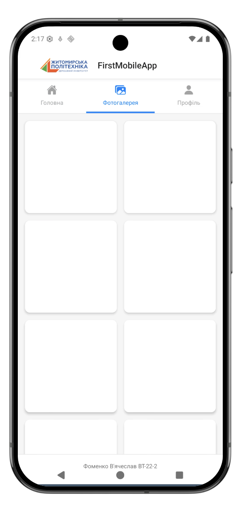
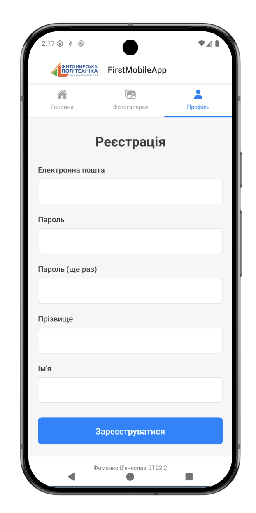

# Фоменко В'ячеслав ВТ-22-2

# FirstMobileApp

Мобільний застосунок для Житомирської політехніки, розроблений за допомогою React Native та Expo.

## Опис проєкту

FirstMobileApp - це навчальний мобільний застосунок, який демонструє основні можливості React Native. Застосунок складається з трьох основних екранів:

- **Головна (Новини)** - відображення списку новин з можливістю перегляду деталей
- **Фотогалерея** - перегляд фотографій у форматі галереї
- **Профіль (Реєстрація)** - форма реєстрації користувача

## 🚀 Інструкція із запуску

### Передумови

Перед початком роботи переконайтеся, що у вас встановлено:

- [Node.js](https://nodejs.org/) (версія 14 або вище)
- [npm](https://www.npmjs.com/) або [yarn](https://yarnpkg.com/)
- [Expo CLI](https://docs.expo.dev/get-started/installation/)

### Встановлення залежностей

```bash
# Клонуйте репозиторій
git clone <url-репозиторію>

# Перейдіть до директорії проєкту
cd lab1

# Встановіть залежності
npm install
# або
yarn install
```

### Запуск застосунку

```bash
# Запуск з використанням Expo
npx expo start

# або
npm start
```

Після запуску відкриється Expo Developer Tools у браузері, де ви зможете вибрати спосіб запуску застосунку.

## 📸 Скріншоти

### Головна сторінка (Новини)


### Фотогалерея


### Реєстрація


## Розбір коду застосунку

### App.js - Головний файл застосунку

**Призначення:** Налаштування навігації та структури застосунку.

```javascript
import { NavigationContainer } from '@react-navigation/native';
import { createNativeStackNavigator } from '@react-navigation/native-stack';
import { createMaterialTopTabNavigator } from '@react-navigation/material-top-tabs';
```

**Основні компоненти:**

#### 1. NavigationContainer
- Обгортка для всієї навігаційної структури
- Управляє станом навігації
- Необхідний для роботи React Navigation

#### 2. Stack Navigator
```javascript
const Stack = createNativeStackNavigator();
```
- Створює стек-навігацію (екрани один над одним)
- Використовується для головного хедера з логотипом

#### 3. Material Top Tabs Navigator
```javascript
const Tab = createMaterialTopTabNavigator();
```
- Створює верхню таб-навігацію
- Дозволяє перемикатися між екранами свайпом
- Показує іконки та підписи табів

**Налаштування хедера:**
```javascript
headerLeft: () => (
  <Image
    source={{
      uri: 'https://ztu.edu.ua/img/logo/university-colored.png',
    }}
    style={{ width: 140, height: 30, marginLeft: 10 }}
    resizeMode="contain"
  />
)
```
- `source` - джерело зображення (URL або локальний файл)
- `resizeMode="contain"` - зображення вміщується повністю без обрізання
- Розміщується зліва від заголовку

**Налаштування табів:**
```javascript
tabBarIcon: ({ color }) => {
  let iconName;
  if (route.name === 'Головна') iconName = 'home';
  if (route.name === 'Фотогалерея') iconName = 'images';
  if (route.name === 'Профіль') iconName = 'person';
  return <Ionicons name={iconName} size={22} color={color} />;
}
```
- Динамічна зміна іконок залежно від активного табу
- `color` автоматично змінюється для активного/неактивного стану
- Використовує бібліотеку `@expo/vector-icons`

### HomeScreen.js - Екран новин

**Основні React компоненти:**

#### ScrollView
```javascript
<ScrollView 
  style={styles.scrollView}
  contentContainerStyle={styles.scrollContent}
>
```
- Дозволяє прокручувати контент, якщо він не вміщується на екрані
- `style` - стилі для самого контейнера
- `contentContainerStyle` - стилі для контенту всередині

#### FlatList vs map()
У нашому коді використано `.map()`:
```javascript
{newsItems.map((item) => (
  <TouchableOpacity key={item.id} style={styles.newsItem}>
    ...
  </TouchableOpacity>
))}
```
- Простіший спосіб для невеликих списків
- `key={item.id}` - обов'язковий унікальний ідентифікатор для оптимізації

**Альтернатива - FlatList** (для великих списків):
```javascript
<FlatList
  data={newsItems}
  renderItem={({ item }) => <NewsCard item={item} />}
  keyExtractor={(item) => item.id.toString()}
/>
```

#### TouchableOpacity
```javascript
<TouchableOpacity key={item.id} style={styles.newsItem}>
```
- Робить елемент інтерактивним (реагує на дотик)
- При натисканні зменшує прозорість (opacity)
- Дає візуальний фідбек користувачу

#### Стилізація карток новин
```javascript
newsItem: {
  flexDirection: 'row',           // Горизонтальне розташування
  backgroundColor: 'white',
  marginHorizontal: 15,           // Відступи з боків
  marginBottom: 12,               // Відступ знизу
  padding: 15,                    // Внутрішні відступи
  borderRadius: 10,               // Заокруглені кути
  shadowColor: '#000',            // Колір тіні
  shadowOffset: {                 // Зміщення тіні
    width: 0,
    height: 2,
  },
  shadowOpacity: 0.1,            // Прозорість тіні
  shadowRadius: 3,               // Радіус розмиття тіні
  elevation: 3,                  // Тінь для Android
}
```

**Важливо:** 
- `shadow*` властивості працюють тільки на iOS
- `elevation` працює тільки на Android
- Потрібно використовувати обидва для крос-платформної сумісності

### GalleryScreen.js - Фотогалерея

#### Dimensions API
```javascript
import { Dimensions } from 'react-native';
const { width } = Dimensions.get('window');
const imageSize = (width - 45) / 2;
```
- Отримує розміри екрану пристрою
- `width - 45` - віднімаємо відступи (15px зліва + 15px між + 15px справа)
- Ділимо на 2 для двох колонок

#### Динамічні розміри
```javascript
style={[styles.imageContainer, { width: imageSize, height: imageSize }]}
```
- `[]` - масив стилів (об'єднує кілька об'єктів стилів)
- Статичні стилі з `StyleSheet` + динамічні inline стилі
- Квадратні зображення (однакова ширина та висота)

#### Flexbox для галереї
```javascript
gallery: {
  flexDirection: 'row',      // Горизонтальне розташування
  flexWrap: 'wrap',          // Перенос на новий рядок
  padding: 15,
  justifyContent: 'space-between',  // Рівномірний розподіл
}
```
- `flexWrap: 'wrap'` - автоматичний перенос елементів
- `space-between` - однаковий відступ між елементами

### ProfileScreen.js - Форма реєстрації

#### State Management з useState
```javascript
const [email, setEmail] = useState('');
const [password, setPassword] = useState('');
```
- `useState('')` - створює стан з початковим значенням
- `email` - поточне значення
- `setEmail` - функція для оновлення значення
- Кожна зміна стану викликає ре-рендер компонента

#### TextInput компонент
```javascript
<TextInput
  style={styles.input}
  value={email}
  onChangeText={setEmail}
  placeholder="Введіть email"
  keyboardType="email-address"
  autoCapitalize="none"
/>
```

**Властивості TextInput:**
- `value` - контрольоване значення (керується через state)
- `onChangeText` - викликається при кожній зміні тексту
- `keyboardType` - тип клавіатури (email, numeric, phone-pad)
- `autoCapitalize` - автоматична капіталізація (none, sentences, words, characters)
- `secureTextEntry` - приховує текст (для паролів)

#### KeyboardAvoidingView
```javascript
<KeyboardAvoidingView 
  style={styles.container}
  behavior={Platform.OS === 'ios' ? 'padding' : 'height'}
>
```
- Автоматично зміщує контент, коли з'являється клавіатура
- Різна поведінка для iOS та Android
- `padding` - додає відступ (iOS)
- `height` - змінює висоту (Android)

#### Platform API
```javascript
import { Platform } from 'react-native';
Platform.OS === 'ios' ? 'padding' : 'height'
```
- Визначає платформу (ios, android, web)
- Дозволяє писати платформо-специфічний код
- Корисно для різної поведінки на різних ОС

### StyleSheet API

```javascript
const styles = StyleSheet.create({
  container: {
    flex: 1,
    backgroundColor: '#f5f5f5',
  },
});
```

**Переваги StyleSheet.create():**
- ✅ Оптимізація продуктивності (стилі створюються один раз)
- ✅ Валідація стилів під час розробки
- ✅ Можливість використання `StyleSheet.flatten()`
- ✅ Краща підтримка IDE (автокомпліт)

**Flex властивості:**
```javascript
container: {
  flex: 1,  // Займає весь доступний простір
}
```
- `flex: 1` - розтягує елемент на всю висоту батьківського контейнера
- За замовчуванням `flexDirection: 'column'` (вертикально)


