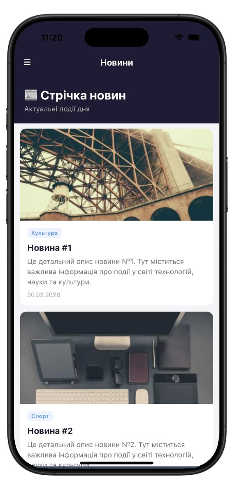
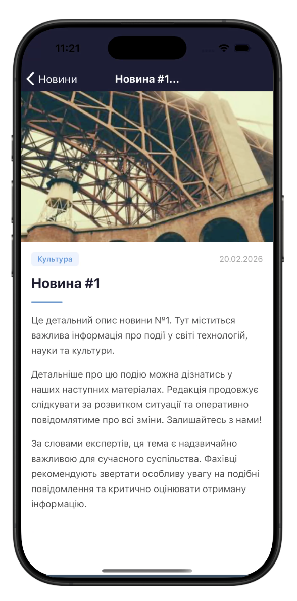
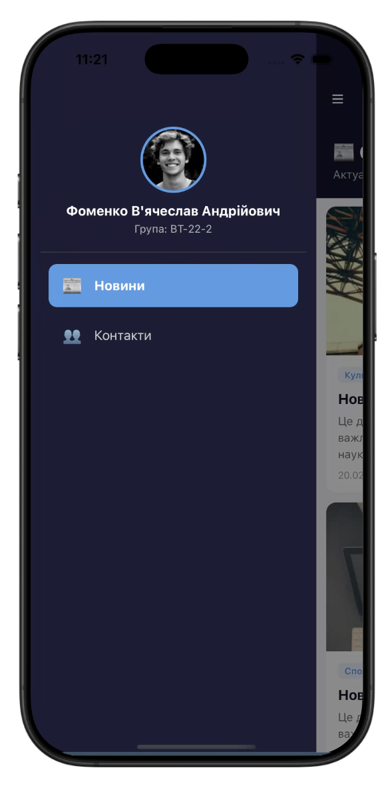

# Фоменко В'ячеслав ВТ-22-2

# Lab 2 – React Native Navigation & Lists

## Інструкція запуску

1. Клонувати репозиторій
2. `npm install`
3. `npx expo start`
4. Відсканувати QR-код у Expo Go або запустити в емуляторі

## Реалізований функціонал

- **Drawer Navigator** з кастомним меню (аватар, ПІБ, група, пункти навігації)
- **Stack Navigator** всередині Drawer (NewsStack: Main → Details)
- **FlatList** з Pull-to-Refresh, Infinite Scroll, Header/Footer/Separator компонентами та оптимізацією
- **SectionList** з групованими контактами, sticky-заголовками та роздільниками
- Передача параметрів між екранами, динамічний заголовок DetailsScreen

## 📸 Скріншоти

### Стрічка новин

### Екран новини

### Меню

### Контакти
