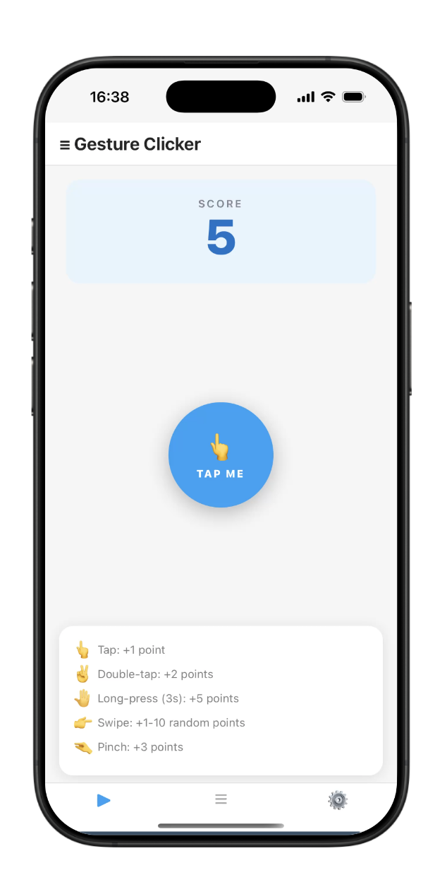
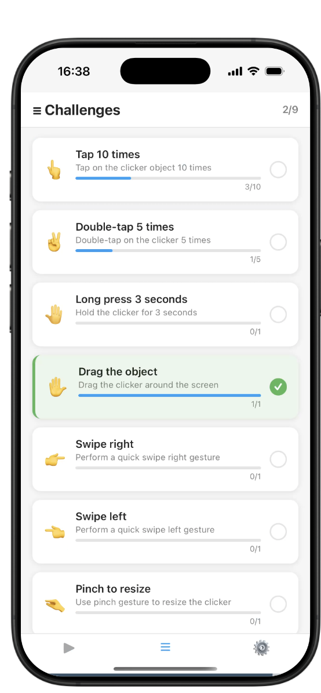
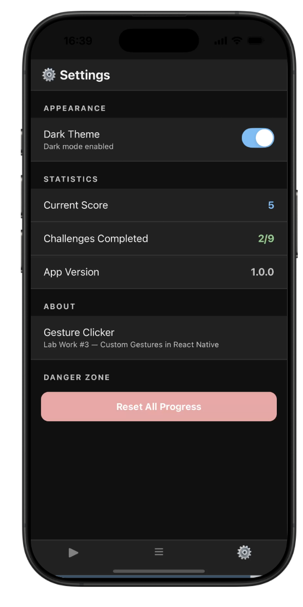

# Gesture Clicker — Лабораторна робота №3 
# Фоменко В'ячеслав ВТ -22-2

## Тема
Використання кастомних жестів у React Native та стилізація інтерфейсу мобільного застосунку.

---

---

## Встановлення та запуск

```bash
# 1. Встановити залежності
npm install

# 2. Для iOS
cd ios && pod install && cd ..
npx react-native run-ios

# 3. Для Android
npx react-native run-android
```

---

## Реалізовані жести

| Жест | Обробник | Очки |
|------|----------|------|
| Одинарне натискання | `TapGestureHandler (numberOfTaps=1)` | +1 |
| Подвійне натискання | `TapGestureHandler (numberOfTaps=2)` | +2 |
| Довге натискання (800мс+) | `LongPressGestureHandler` | +5 |
| Перетягування | `PanGestureHandler` | — |
| Свайп вправо | `FlingGestureHandler (Directions.RIGHT)` | +1–10 |
| Свайп вліво | `FlingGestureHandler (Directions.LEFT)` | +1–10 |
| Pinch (масштабування) | `PinchGestureHandler` | +3 |

---

## Завдання (Challenges)

1. ✅ Зробити 10 кліків
2. ✅ Подвійний клік 5 разів
3. ✅ Утримувати 3 секунди (LongPress)
4. ✅ Перетягнути об'єкт (Pan)
5. ✅ Свайп вправо
6. ✅ Свайп вліво
7. ✅ Pinch (змінити розмір)
8. ✅ Набрати 100 очок
9. ✅ Combo Master — використати 3 різних жести (власне завдання)

---

## Стилізація

- **Styled Components** (`styled-components/native`)
- Підтримка **світлої та темної теми** через `ThemeContext`
- Перемикання теми у розділі **Settings**

---

## Навігація

- `@react-navigation/native` + `@react-navigation/bottom-tabs`
- 3 вкладки: Гра / Завдання / Налаштування


##  Скриншоти 

### Головна сторінка


### Досягнення


### Налаштування
