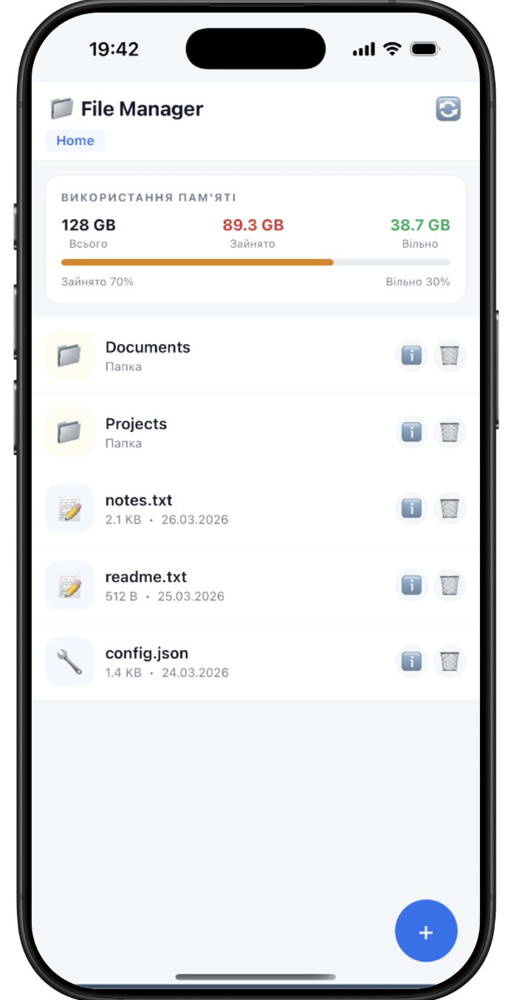

# File Manager — Лабораторна робота №4

**Тема:** Робота з файловою системою в React Native з використанням `expo-file-system`

---

## Структура проекту

```
FileManager/
├── App.tsx                              # Кореневий компонент
├── app.json                             # Конфігурація Expo
├── babel.config.js
├── package.json
└── src/
    ├── theme/
    │   └── index.ts                     # Кольори, відступи, радіуси
    ├── context/
    │   └── FileManagerContext.tsx       # Стан навігації (поточний шлях, історія)
    ├── utils/
    │   └── fileUtils.ts                 # Всі операції з expo-file-system
    ├── components/
    │   ├── Styled.ts                    # styled-components
    │   ├── MemoryCard.tsx               # Картка статистики пам'яті
    │   ├── FileListItem.tsx             # Рядок файлу/папки
    │   ├── CreateModal.tsx              # Модал створення файлу/папки
    │   └── FileInfoModal.tsx            # Модал детальної інформації
    ├── screens/
    │   ├── ExplorerScreen.tsx           # Головний екран (провідник)
    │   └── EditorScreen.tsx             # Редактор текстових файлів
    └── navigation/
        └── AppNavigator.tsx             # Stack Navigator
```

---

### Кроки

```bash

npm install

npx expo start
```

---

## ✅ Реалізований функціонал

### 1. Навігація по файловій системі
- Відображення **поточного шляху** (breadcrumbs у заголовку)
- Список файлів і папок через `FlatList`
- Перехід у вкладені папки
- Кнопка **«назад»** (← ) та **«додому»** (🏠)
- Папки відображаються першими, потім файли

### 2. Створення
- **Нова папка** — введення назви в модальному вікні → `FileSystem.makeDirectoryAsync`
- **Новий файл** (.txt) — введення назви та початкового вмісту → `FileSystem.writeAsStringAsync`
- FAB-кнопка `+` розгортається в два варіанти

### 3. Зчитування
- Відкриття `.txt` та інших текстових файлів (md, json, js, ts, html, csv, log)
- Вміст завантажується через `FileSystem.readAsStringAsync`
- Режим **перегляду** (👁) та **редагування** (✏️)

### 4. Редагування
- Повноцінний редактор з `TextArea`
- Індикатор незбережених змін (жовтий чіп «Не збережено»)
- Збереження через `FileSystem.writeAsStringAsync`
- При виході з незбереженими змінами — Alert із варіантами

### 5. Видалення
- Кнопка 🗑️ на кожному елементі
- **Підтвердження** через `Alert.alert` перед видаленням
- Для папок — попередження про видалення всього вмісту
- `FileSystem.deleteAsync({idempotent: true})`

### 6. Детальна інформація про файл
- Кнопка ℹ️ відкриває модал з атрибутами:
  - Назва файлу
  - Тип файлу (за розширенням)
  - Розмір (форматований: B / KB / MB / GB)
  - Дата останньої модифікації
  - Повний шлях

### 7. Статистика пам'яті пристрою
На головному екрані відображається картка з:
- **Загальний обсяг** — `FileSystem.getTotalDiskCapacityAsync()`
- **Вільний простір** — `FileSystem.getFreeDiskStorageAsync()`
- **Зайнятий простір** — різниця
- Графічний прогрес-бар (змінює колір: синій → жовтий → червоний)

---

## Скриншоти

### Головна сторінка


### Папка


### Файл


### Порожня папка
