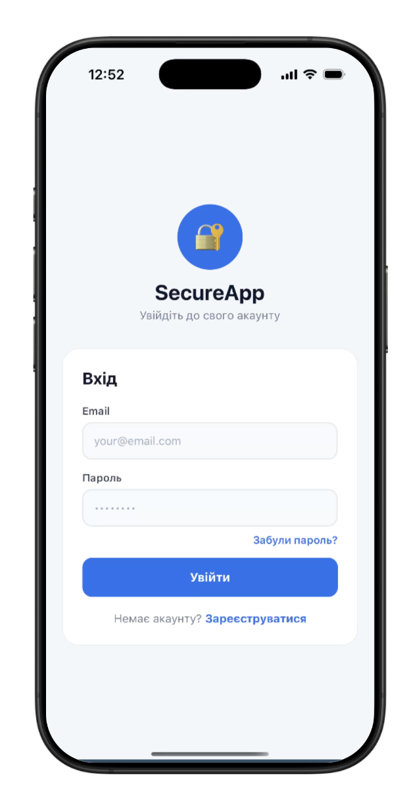
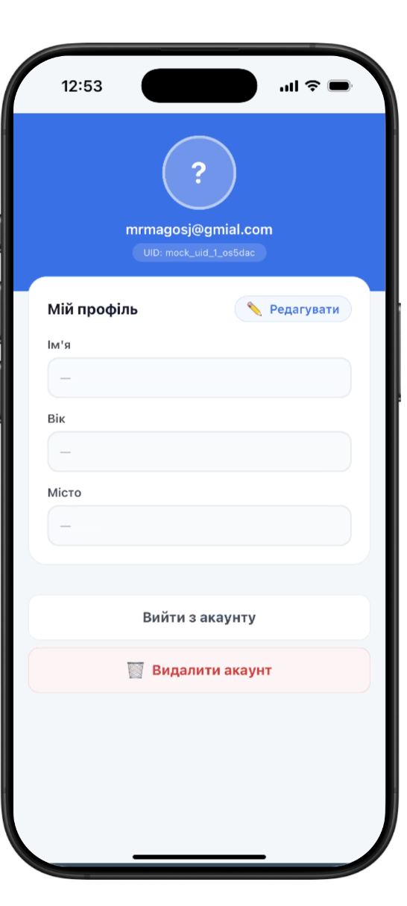
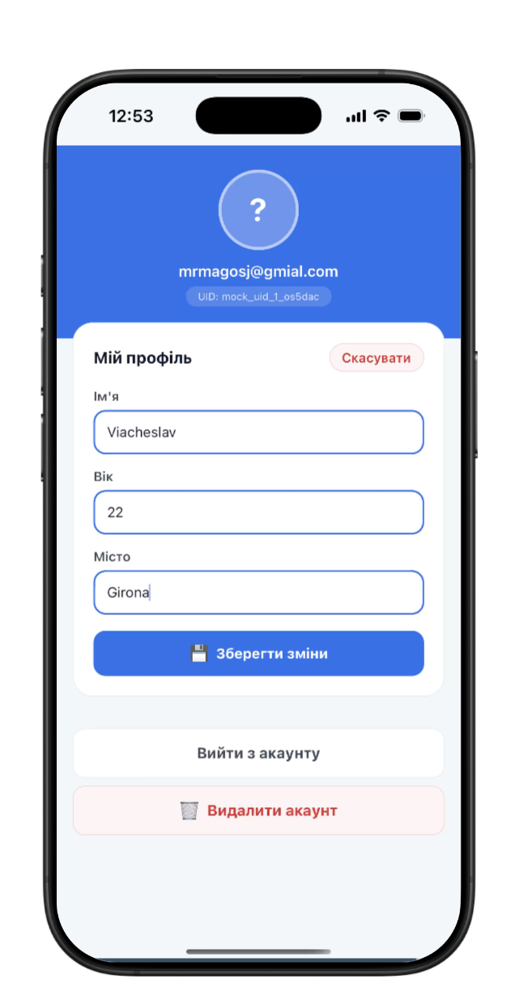
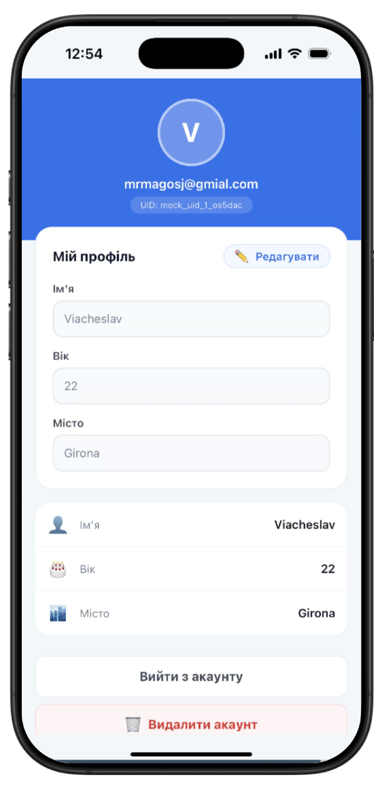

# Lab6 — Firebase Auth + Firestore + Expo Router

---

## Запуск

```bash
npm install
npx expo start
```

---

## Реалізований функціонал

| Пункт | Технологія |
|---|---|
| Реєстрація | `createUserWithEmailAndPassword` + `setDoc` у Firestore |
| Вхід | `signInWithEmailAndPassword` + завантаження профілю |
| Вихід | `signOut` |
| Скидання паролю | `sendPasswordResetEmail` |
| Профіль (ім'я, вік, місто) | `updateDoc` у колекції `users/{uid}` |
| Видалення акаунту | Реавторизація → `deleteDoc` → `deleteUser` |
| Захист маршрутів | `(app)/_layout.jsx` → `<Redirect href="/login" />` |
| Security Rules | Користувач читає/пише тільки `users/{свій uid}` |
| .env | `EXPO_PUBLIC_*` змінні читаються через `process.env` |

---

## Скриншоти

### Логін


### Мейн сорніка


### Едіт


### Мейн сторінка
